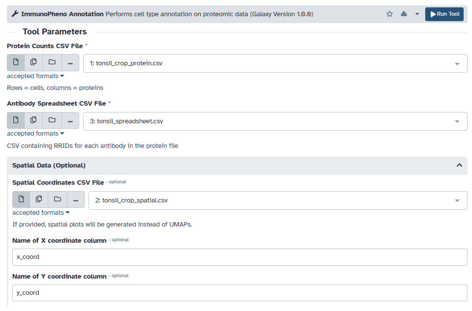
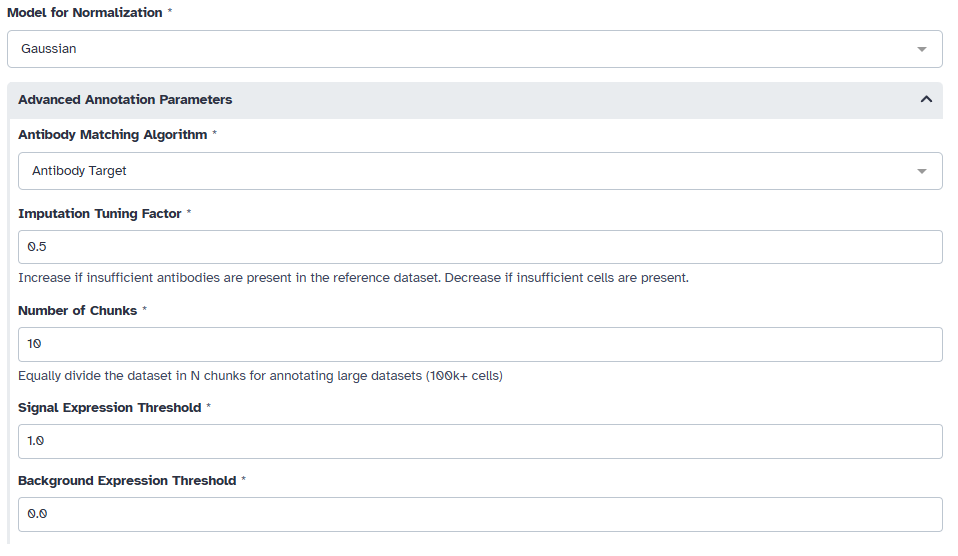
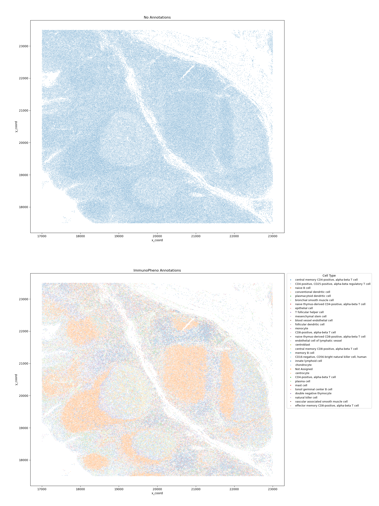

Galaxy Platform: Automated Annotation of Cell Identities in mIHC Data
=====================================================================

ImmunoPheno's automated annotation pipeline is also available through the `Galaxy Platform <https://usegalaxy.org/>`_.
In this tutorial, we demonstrate how to use the `ImmunoPheno Annotation tool <https://toolshed.g2.bx.psu.edu/view/lincolnwu/immunopheno/0cf5de252348>`_
published on Galaxy to annotate cell identities in a multiplexed mIHC dataset using reference data
stored in the ImmunoPhenoDB database. We consider a human tonsil tissue section that has been profiled
with PhenoCycler using a panel of 26 antibodies.

The human tonsil dataset is stored as CSV files. Begin by uploading
each file onto Galaxy, and then loading them into the protein, antibody spreadsheet, and spatial fields. As stated
in the tool description, the data must follow the following format:

**CSV File Formats**

        **Protein Counts:** A CSV file containing the raw counts, where the rows are cells and columns are protein markers.  
        You can optionally provide a spatial coordinates file, with a matching index to those in the protein counts, 
        as well as two columns for the X and Y coordinates.

            +------------------------+------------+----------+------------+----------+------------+----------+ 
            |                        | CD11a                 | CD3                   | CD56                  |
            +========================+============+==========+============+==========+============+==========+
            | cell_barcode_1         | 3                     | 0                     | 2                     |
            +------------------------+------------+----------+------------+----------+------------+----------+
            | cell_barcode_2         | 6                     | 4                     | 0                     |
            +------------------------+-----------------------+-----------------------+-----------------------+
            | cell_barcode_3         | 10                    | 52                    | 32                    |
            +------------------------+-----------------------+-----------------------+-----------------------+
        
        **Antibody Spreadsheet:** A CSV file mapping the protein markers in your counts file to RRIDs. 
        This spreadsheet must contain a line called "Antibody table" with the antibody names and IDs underneath. The
        names of the antibodies must correspond with those in the protein table.

            +------------------------+------------+----------+ 
            | Antibody table:        |                       |
            +========================+============+==========+
            | CD11a                  | AB_2734365            |
            +------------------------+------------+----------+
            | CD3                    | AB_2734246            |
            +------------------------+-----------------------+
            | CD56                   | AB_2749970            |
            +------------------------+-----------------------+

        **Spatial Data (optional)**: A CSV file containing the 2D spatial coordinates of each cell from the protein data.
        The rows must match those found in the protein data, while the X and Y-coordinate columns can be modified.

            +------------------------+------------+----------+------------+----------+
            |                        | x_coord               | y_coord               |
            +========================+============+==========+============+==========+
            | cell_barcode_1         | 123.0                 | 451.4                 | 
            +------------------------+------------+----------+------------+----------+
            | cell_barcode_2         | 70.0                  | 170.3                 |
            +------------------------+-----------------------+-----------------------+
            | cell_barcode_3         | 101.3                 | 23.3                  |
            +------------------------+-----------------------+-----------------------+

If spatial coordinates are provided, specify the name of the columns in the CSV corresponding to the X and Y coordinates.

We need to first normalize the mIHC data using ImmunoPheno's normalization pipeline. For mIHC data, we choose to use the Gaussian model.
By default, ImmunoPheno uses the "antibody target" matching algorithm to find a corresponding reference dataset in the ImmunoPhenoDB database.
This parameter allows ImmunoPheno to search for proteomic data based on similar antibody targets in the mIHC dataset and those currently in the database.
Moreover, to handle any potential missing data in the reference, a tunable imputation hyperparameter (0.5) can be adjusted to keep more cells or antibodies in the reference.
For large mIHC datasets (100k+ cells), consider dividing the dataset into equal chunks to avoid memory issues. This dataset was divided into 10 even chunks
for the annotation process.

Once the annotation process is complete, the tool outputs a before and after of the annotated mIHC data.

