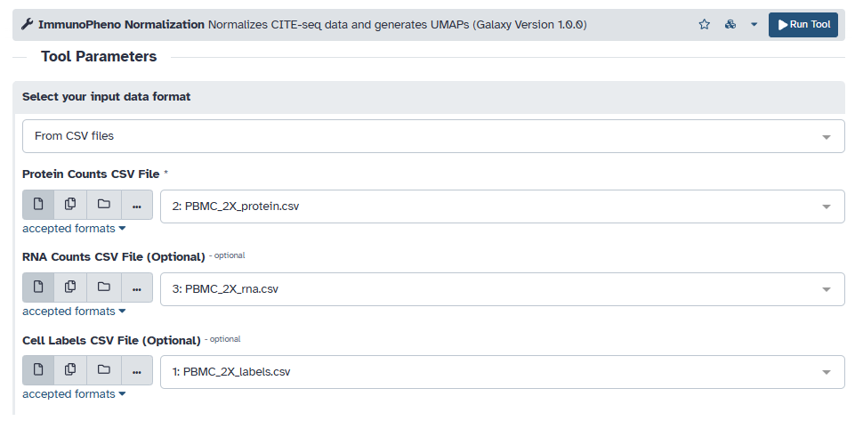
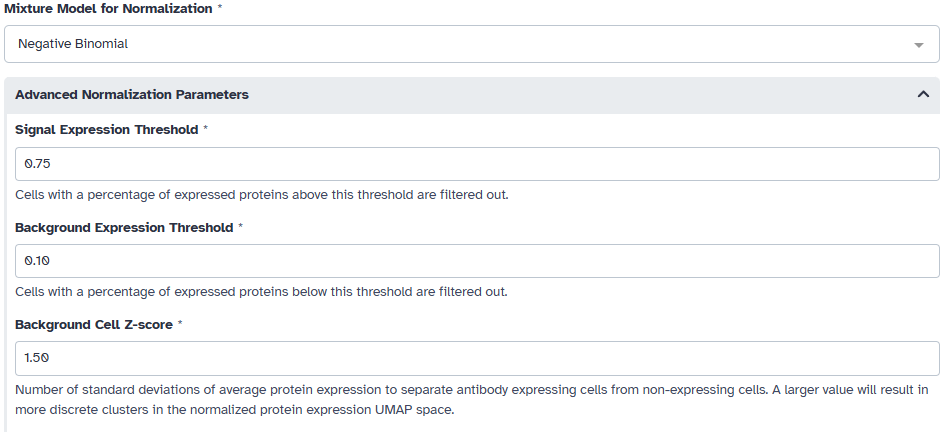
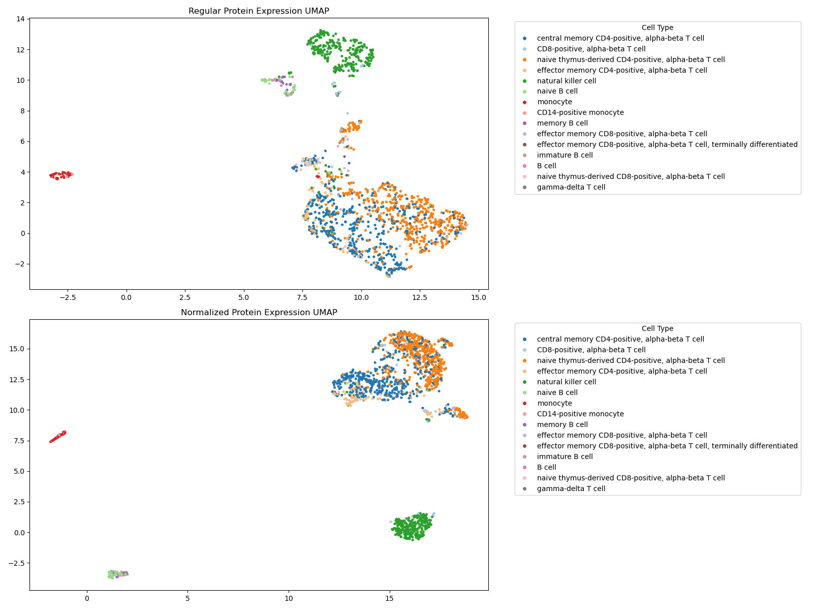
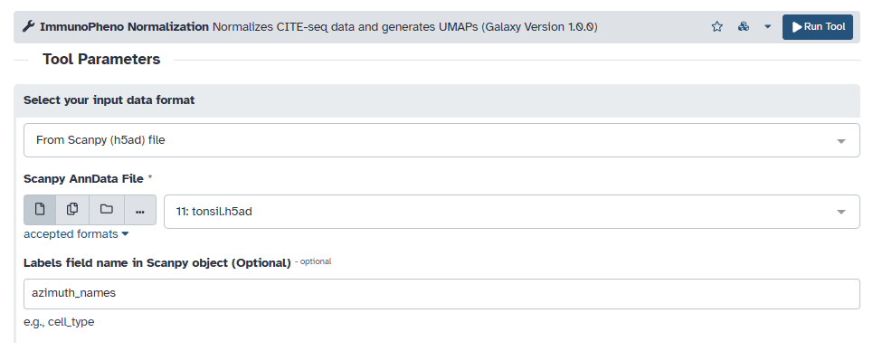
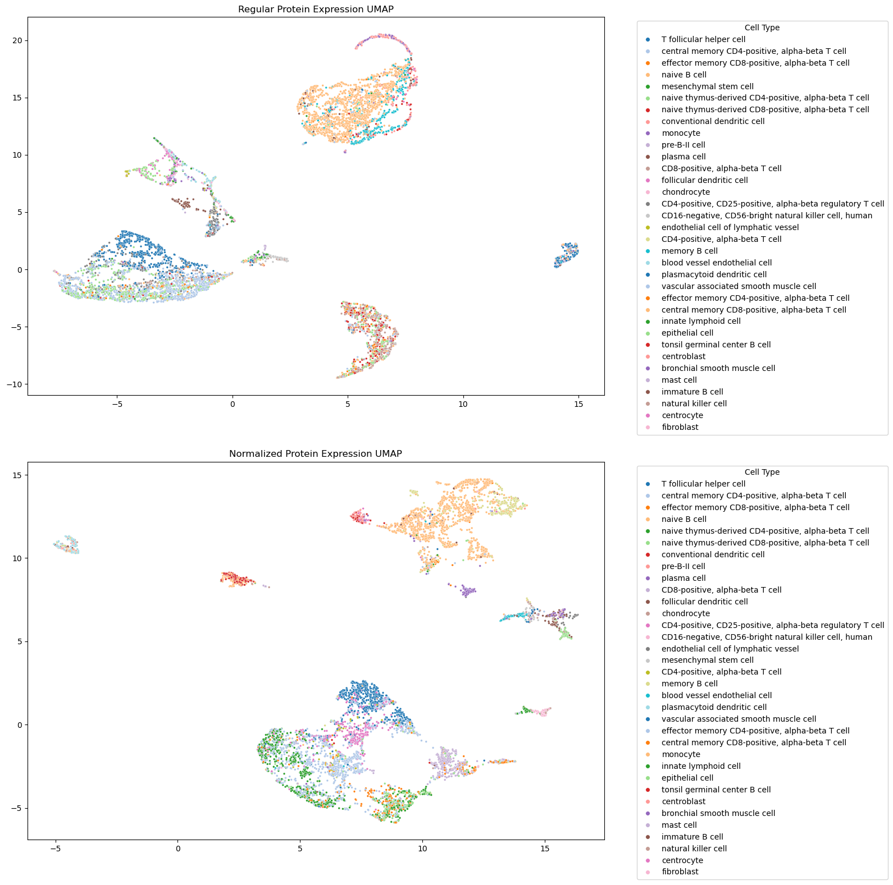

Galaxy Platform: Normalizing CITE-Seq Data
==========================================

ImmunoPheno's normalization pipeline is also available through the `Galaxy Platform <https://usegalaxy.org/>`_.
In this tutorial, we demonstrate how to use the ImmunoPheno Normalization tool published on Galaxy 
to normalize protein data from two different CITE-seq datasets. The first dataset, provided
as **CSV** files, contains human PBMCs including 114 antibodies. The second dataset, provided as an
AnnData **h5ad** file, contains human tonsil cells including 38 antibodies. Cells that do not pass
the quality controls have been already filtered out and the remaining cells have been annotaetd
using standard software for single-cell RNA-seq data analysis.

Human PBMCs
-----------
The first dataset's CITE-seq data and associated labels is stored as CSV files. Begin by uploading
each file onto Galaxy, and then loading them into the protein, RNA, and labels input field. As stated
in the tool description on Galaxy, the input data must follow the following format:

**CSV File Formats**

        **Protein CSV:** A CSV file containing the raw counts, where the rows are cells and columns are protein markers.

            +------------------------+------------+----------+------------+----------+------------+----------+ 
            |                        | CD11a                 | CD3                   | CD56                  |
            +========================+============+==========+============+==========+============+==========+
            | cell_barcode_1         | 3                     | 0                     | 2                     |
            +------------------------+------------+----------+------------+----------+------------+----------+
            | cell_barcode_2         | 6                     | 4                     | 0                     |
            +------------------------+-----------------------+-----------------------+-----------------------+
            | cell_barcode_3         | 10                    | 52                    | 32                    |
            +------------------------+-----------------------+-----------------------+-----------------------+

        **RNA CSV (optional):** A CSV file containing the scRNA-seq (transcript count), where the rows are cells and columns are genes.
        The rows must match those found in the protein data.

            +------------------------+------------+----------+------------+----------+------------+----------+ 
            |                        | Gene1                 | Gene2                 | Gene3                 |
            +========================+============+==========+============+==========+============+==========+
            | cell_barcode_1         | 0                     | 0                     | 2                     |
            +------------------------+------------+----------+------------+----------+------------+----------+
            | cell_barcode_2         | 1                     | 3                     | 0                     |
            +------------------------+-----------------------+-----------------------+-----------------------+
            | cell_barcode_3         | 7                     | 0                     | 0                     |
            +------------------------+-----------------------+-----------------------+-----------------------+
        
        **Cell Label CSV (optional):** A CSV file containing cell labels/annotations for each cell, where the rows are cells and there
        exists at least one column named "celltype". This will label populations on the UMAP. The rows must match those found in the protein data. 

            +------------------------+------------+----------+
            |                        | celltype              |
            +========================+============+==========+
            | cell_barcode_1         | naive B cell          |
            +------------------------+------------+----------+
            | cell_barcode_2         | monocyte              |
            +------------------------+-----------------------+
            | cell_barcode_3         | natural killer cell   |
            +------------------------+-----------------------+

Afterwards, we must fit a 1- to 3-component mixture models for each antibody in the data. For CITE-seq data
we choose to use the negative binomial model. We also want to filter out cells that express most of the
profiled proteins or a very number of proteins. In this example, we filter out cells that express less than 10% of 
the profiled proteins or more than 75% of the profiled proteins. We also choose a sepration of 1.5 standard deviations
from the expression value of cells that do not express the protein for our UMAP space.

Putting this all together, the tool outputs a before and after of the protein expression data. As expected,
cell populations appear more intermixed in the non-normalized protein expression data compared to the
normalized data. 

Human Tonsil
------------

Another file format that ImmunoPheno can process are AnnData objects. Begin by uploading the h5ad file
onto Galaxy, and then loading it into the "Scanpy file" input field. If your AnnData object contains cell labels,
enter the name of the field in the input (e.g., 'azimuth_names').

Since this is also CITE-seq data, we choose to use a negative binomial model for fitting mixture models to each antibody.
We also use the same filtering thresholds and separation value as before for this example.

.. image:: images/normalization_2b.png

As expected, we see that the cell populations in the normalized UMAP appear more localized.

