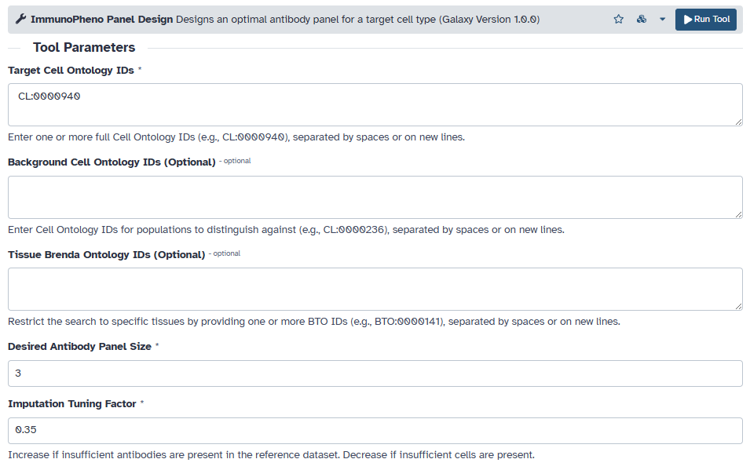
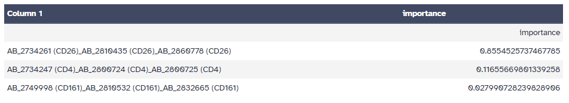
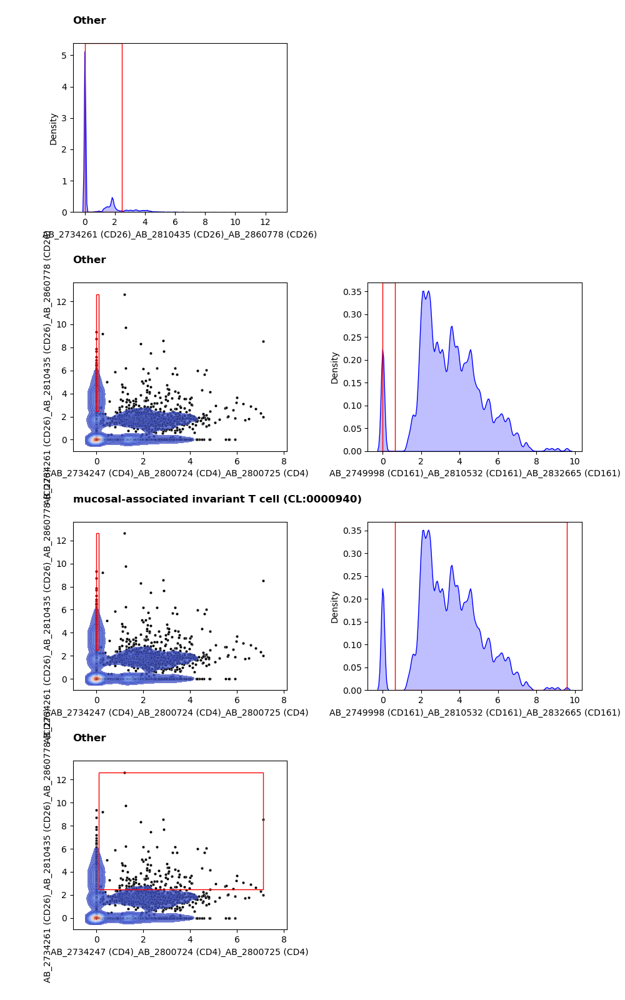
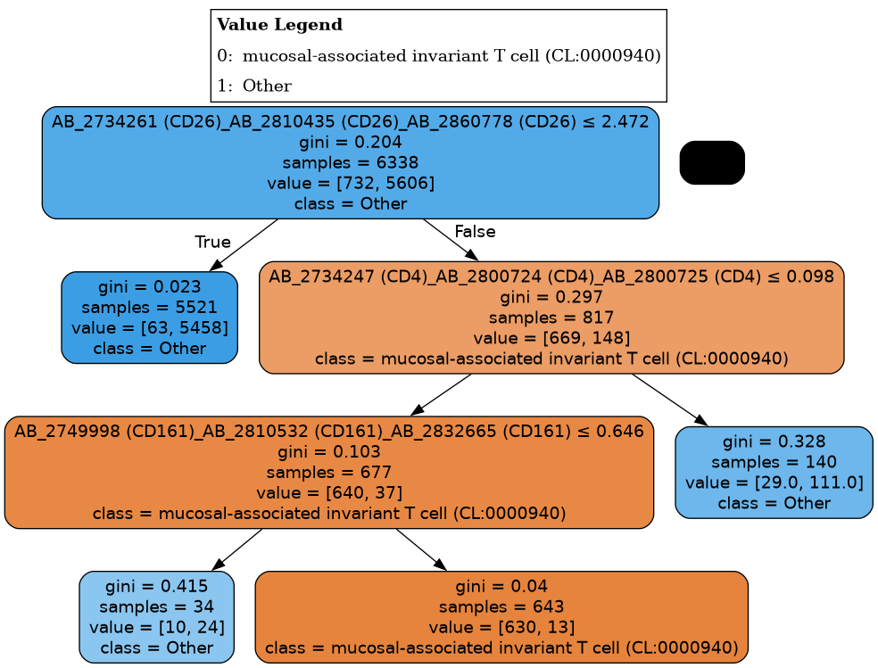
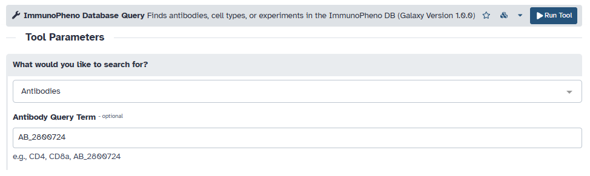
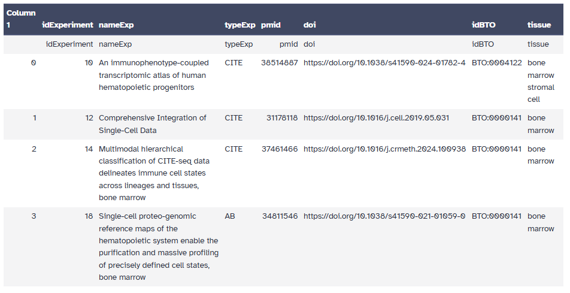
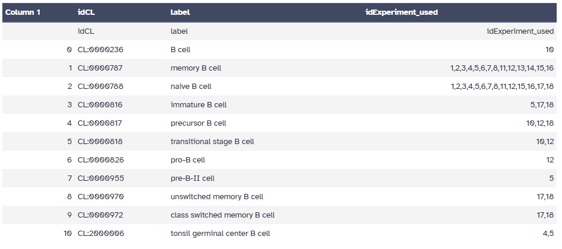
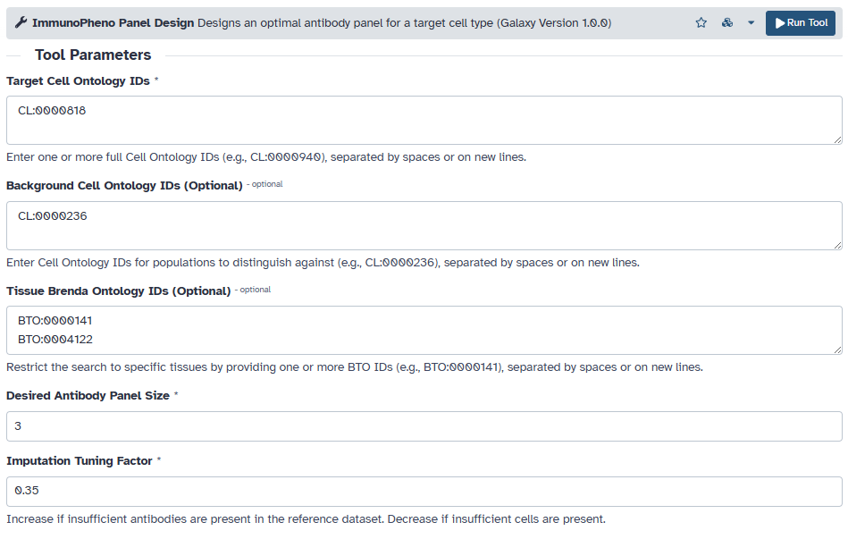
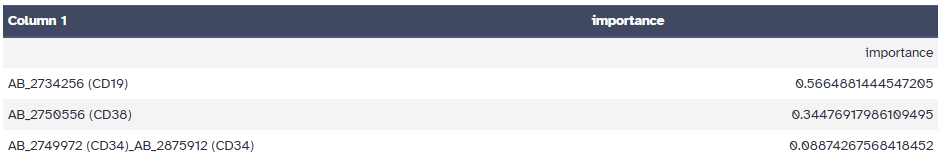
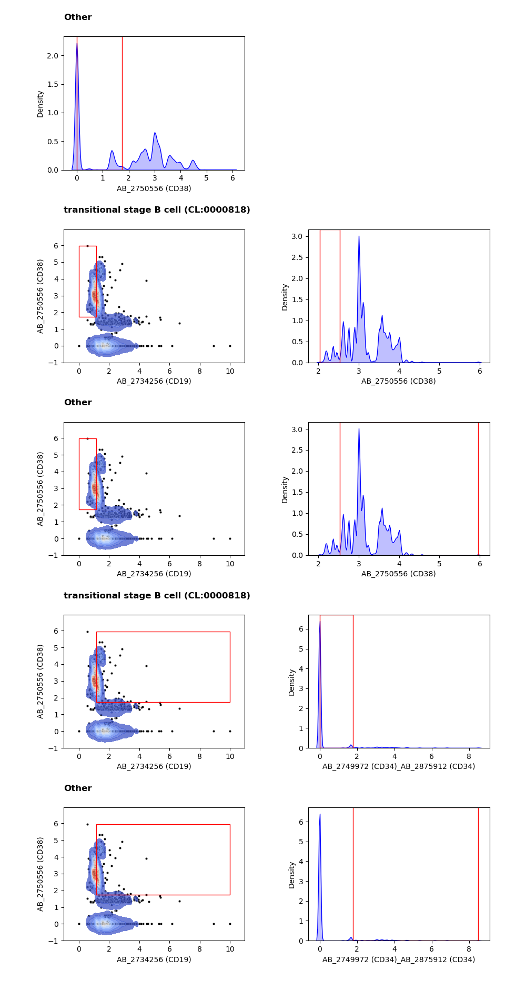

Galaxy Platform: Design of Antibody Panels
==========================================

ImmunoPheno's optimal antibody panel pipeline is also available through the `Galaxy Platform <https://usegalaxy.org/>`_.
In this tutorial, we demonstrate how to use the `ImmunoPheno Database Query <https://toolshed.g2.bx.psu.edu/view/lincolnwu/immunopheno/0cf5de252348>`_ 
and `ImmunoPheno Panel Design <https://toolshed.g2.bx.psu.edu/view/lincolnwu/immunopheno/0cf5de252348>`_ tool 
published on Galaxy to design optimal antibody panels and gating strategies to isolate populations of interest.

In the first example, we will create a three-antibody panel to isolate mucosal-associated invariant T (MAIT) cells. To begin, 
we will use the ImmunoPheno Database Query tool to identify the cell ontology ID for MAIT cells. Select "Cell Types" as 
the type of query, followed by the search phrase "mucosal".

After the query has completed, the tool outputs the following table. The table contains information from the database relevant to
the search phrase.

We can now use the cell ontology ID retrieved from this table (CL:0000940) to identify an optimal set of three antibodies and
the corresponding gating strategy for isolating this population. Similar to the ImmunoPheno Annotation tool, this tool contains
a tunable hyperparmeter to handle missing data from the reference dataset retrieved from the ImmunoPhenoDB database.

The tool retrieves the optimal set of three antibodies, the corresponding gating strategies, and the decision tree associated with each gate.
The "importance" column quantifies how informative each antibody is. For each surface marker, ImmunoPheno may return multiple antibody IDs, since it does not 
distinguish between antibodies from different vendors corresponding to the same antibody clone.

We can now retrieve additional information about the selected antibodies using the ImmunoPheno Database Query tool:

.. image:: images/query_2b.png

In the second example, we will show how ImmunoPheno also allows us to specify one or more background populations and tissue contexts when designing
antibody panels. For example, let us find a three-antibody panel for isolating transitional B cells from other B cells in the bone marrow.
We can identify the tissue ontology ID for bone marrow by searching for relevant experiments using the ImmunoPheno Database Query tool:

.. image:: images/query_3a.png

We can also identify the cell ontology IDs for transitional B cells by searching for cell types using the ImmunoPheno Database Query tool:

.. image:: images/query_4a.png

With this information, we can now retrieve the optimal set of three antibodies:

.. image:: images/panel_2d.png